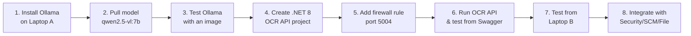

# Ollama OCR Development

Extract text and data from images using local AI vision models via Ollama. Designed for the PayStation microservices stack (.NET 8 + PostgreSQL).

## Overview

This skill helps you:
1. Choose and download the best Ollama vision model for OCR
2. Set up Ollama on Windows (standalone or in Docker)
3. Build .NET 8 API endpoints for image text extraction
4. Integrate OCR into your microservices (KYC, invoices, receipts)
5. Run OCR as a separate service or alongside existing APIs
6. **Track all actions with date/time stamps**

## Hardware Reference (Your Laptops)

### Laptop A (This one — Best for Ollama / GPU)

| Component | Spec |
|-----------|------|
| **Model** | ASUS (unknown model) |
| **CPU** | AMD Ryzen 7 4800H (8 cores, 16 threads) |
| **RAM** | 23.4 GB |
| **GPU** | NVIDIA GeForce RTX 3050 Ti Laptop GPU (4GB VRAM) + AMD Radeon Graphics (512MB) |
| **C: Drive** | 21.5 GB free / 322 GB total ⚠️ Low space |
| **D: Drive** | 38.2 GB free / 164.7 GB total ✅ Install models here |
| **IP** | `192.168.68.113` |
| **Ollama** | ❌ Not yet installed |

### Laptop B

| Component | Spec |
|-----------|------|
| **GPU** | Intel UHD Graphics 620 (Shared, no dedicated VRAM) |
| **RAM** | 15.9 GB |
| **IP** | `192.168.68.107` |
| **Ollama** | Not yet installed |

### Where to Run Ollama

| Laptop | GPU Acceleration | Max Model | Verdict |
|--------|-----------------|-----------|---------|
| **Laptop A** ⭐ | ✅ RTX 3050 Ti (CUDA) | Up to 7B models (Qwen2.5-VL, LLaVA) | **Best choice** |
| **Laptop B** | ❌ Intel UHD (no CUDA) | CPU-only, slower | Use as client only |

> **Recommendation:** Install Ollama on **Laptop A** (GPU accelerated). Laptop B and any Docker services connect to it via LAN at `http://192.168.68.113:11434`.

---

## Which Model to Use

| Model | Size | VRAM | RAM | OCR Quality | Speed | Fits Laptop A? |
|-------|------|------|-----|-------------|-------|----------------|
| **Qwen2.5-VL 7B** ⭐ | 4.7GB | 4GB+ | 8GB+ | ⭐⭐⭐⭐⭐ Best | ⚡ Fast | ✅ Yes (4GB VRAM) |
| **LLaVA 7B** | 4.5GB | 4GB+ | 8GB+ | ⭐⭐⭐ Good | ⚡ Fast | ✅ Yes (4GB VRAM) |
| **Florence-2** | 1.2GB | 2GB+ | 4GB+ | ⭐⭐⭐ Good | ⚡⚡ Very Fast | ✅ Yes (lightweight) |
| **Llama 3.2 Vision 11B** | 7.9GB | 8GB+ | 12GB+ | ⭐⭐⭐⭐ Great | 🐌 Slower | ❌ Needs 8GB VRAM |

**Recommendation:** `qwen2.5-vl:7b` — best balance of accuracy, size, and speed for your RTX 3050 Ti.

---

## Development Workflow (Step-by-Step)

Here's the exact order of steps to go from nothing → working OCR on your laptops:



### Quick Start (TL;DR)

```cmd
:: ===== On Laptop A =====

:: 1. Install Ollama
winget install Ollama.Ollama

:: 2. Set models to D: drive (save C: space)
mkdir D:\ollama_models
setx OLLAMA_MODELS D:\ollama_models /M
net stop ollama && net start ollama

:: 3. Pull model
ollama pull qwen2.5-vl:7b

:: 4. Test locally
ollama run qwen2.5-vl:7b "Extract text" --image test.jpg

:: 5. Start Ollama as API server
ollama serve
:: (Runs on http://192.168.68.113:11434)

:: 6. Create .NET OCR service, then run:
dotnet run --project Ocr.API --urls http://0.0.0.0:5004
```

---

## Step 1: Install Ollama on Laptop A

### On Windows (Standalone)

Download from [ollama.com](https://ollama.com/download/windows) or:

```cmd
winget install Ollama.Ollama
```

### Save models to D: drive (save C: space)

Before pulling any models, set the models directory:

```cmd
:: Create folder on D:
mkdir D:\ollama_models

:: Set environment variable (System-wide)
setx OLLAMA_MODELS D:\ollama_models /M

:: Restart Ollama service
net stop ollama
net start ollama
```

### Pull the OCR model

```cmd
ollama pull qwen2.5-vl:7b
```

### Test it with an image

```cmd
ollama run qwen2.5-vl:7b "Extract all text from this image" --image C:\path\to\test.jpg
```

---

## Step 2: Choose Where to Run Ollama

### Setup A: Ollama on Laptop A (This one — RTX 3050 Ti)

```cmd
:: Laptop A IP: 192.168.68.113
:: Ollama runs here with GPU acceleration
ollama serve
```

Laptop B or any microservice connects via:

```
http://192.168.68.113:11434
```

### Setup B: Ollama in Docker (alongside your services)

Add to your `docker-compose.yml`:

```yaml
services:
  ollama:
    image: ollama/ollama:latest
    container_name: ollama
    ports:
      - "11434:11434"
    volumes:
      - D:\ollama_models:/root/.ollama
    restart: unless-stopped
    deploy:
      resources:
        reservations:
          devices:
            - driver: nvidia
              count: all
              capabilities: [gpu]
```

Pull model inside the container:

```cmd
docker exec ollama ollama pull qwen2.5-vl:7b
```

---

## Step 3: .NET 8 OCR Service

### Create a new OCR microservice (recommended)

```
services/Services/Ocr/
├── Ocr.API/
│   ├── Controllers/OcrController.cs
│   ├── Program.cs
│   └── appsettings.json
├── Ocr.Manager/
│   └── OcrService.cs
└── Ocr.DAL/
    └── OcrDbContext.cs
```

### OcrService.cs

```csharp
using System.Text.Json;

namespace Ocr.Manager;

public class OcrService
{
    private readonly HttpClient _httpClient;

    public OcrService(HttpClient httpClient)
    {
        _httpClient = httpClient;
    }

    public async Task<string> ExtractTextAsync(string imageBase64, string? prompt = null)
    {
        prompt ??= "Extract all text from this image. Return only the extracted text, no explanations or descriptions.";

        var request = new
        {
            model = "qwen2.5-vl:7b",
            prompt = prompt,
            images = new[] { imageBase64 },
            stream = false,
            options = new
            {
                temperature = 0.1,  // Low temp for accurate OCR
                top_p = 0.9
            }
        };

        var response = await _httpClient.PostAsJsonAsync("http://192.168.68.113:11434/api/generate", request);
        response.EnsureSuccessStatusCode();

        var json = await response.Content.ReadAsStringAsync();
        var result = JsonSerializer.Deserialize<OllamaResponse>(json);
        return result?.Response ?? string.Empty;
    }

    public async Task<ExtractedDocument> ExtractDocumentAsync(string imageBase64)
    {
        var prompt = @"
Extract the following fields from this document image and return them as JSON:
- document_type (e.g., NID, Passport, Invoice, Receipt)
- document_number
- full_name
- date_of_birth
- issue_date
- expiry_date
- address
- amount (if applicable)
- merchant (if applicable)
Return ONLY valid JSON, no other text.";

        var text = await ExtractTextAsync(imageBase64, prompt);
        return JsonSerializer.Deserialize<ExtractedDocument>(text) ?? new ExtractedDocument();
    }
}

public class OllamaResponse
{
    public string? Response { get; set; }
    public bool Done { get; set; }
}

public class ExtractedDocument
{
    public string? DocumentType { get; set; }
    public string? DocumentNumber { get; set; }
    public string? FullName { get; set; }
    public string? DateOfBirth { get; set; }
    public string? IssueDate { get; set; }
    public string? ExpiryDate { get; set; }
    public string? Address { get; set; }
    public string? Amount { get; set; }
    public string? Merchant { get; set; }
}
```

### OcrController.cs

```csharp
[ApiController]
[Route("api/[controller]")]
public class OcrController : ControllerBase
{
    private readonly OcrService _ocrService;

    public OcrController(OcrService ocrService)
    {
        _ocrService = ocrService;
    }

    /// <summary>
    /// Upload an image and extract all text
    /// </summary>
    [HttpPost("extract")]
    public async Task<IActionResult> ExtractText(IFormFile file)
    {
        if (file == null || file.Length == 0)
            return BadRequest("No file uploaded");

        using var ms = new MemoryStream();
        await file.CopyToAsync(ms);
        var base64 = Convert.ToBase64String(ms.ToArray());

        var text = await _ocrService.ExtractTextAsync(base64);
        return Ok(new { fileName = file.FileName, extractedText = text });
    }

    /// <summary>
    /// Upload a document image and get structured fields
    /// </summary>
    [HttpPost("document")]
    public async Task<IActionResult> ExtractDocument(IFormFile file)
    {
        if (file == null || file.Length == 0)
            return BadRequest("No file uploaded");

        using var ms = new MemoryStream();
        await file.CopyToAsync(ms);
        var base64 = Convert.ToBase64String(ms.ToArray());

        var doc = await _ocrService.ExtractDocumentAsync(base64);
        return Ok(doc);
    }

    /// <summary>
    /// Pass base64 image directly in JSON body
    /// </summary>
    [HttpPost("extract-base64")]
    public async Task<IActionResult> ExtractTextFromBase64([FromBody] OcrRequest request)
    {
        var text = await _ocrService.ExtractTextAsync(request.ImageBase64, request.Prompt);
        return Ok(new { extractedText = text });
    }
}

public class OcrRequest
{
    public string ImageBase64 { get; set; } = string.Empty;
    public string? Prompt { get; set; }
}
```

### Program.cs

```csharp
var builder = WebApplication.CreateBuilder(args);

builder.Services.AddControllers();
builder.Services.AddHttpClient<OcrService>(client =>
{
    client.Timeout = TimeSpan.FromSeconds(120); // OCR can take time
});
builder.Services.AddEndpointsApiExplorer();
builder.Services.AddSwaggerGen();

var app = builder.Build();
app.UseSwagger();
app.UseSwaggerUI();
app.MapControllers();
app.Run();
```

### Dockerfile for OCR service

```dockerfile
FROM mcr.microsoft.com/dotnet/aspnet:8.0 AS base
WORKDIR /app
EXPOSE 8080

FROM mcr.microsoft.com/dotnet/sdk:8.0 AS build
WORKDIR /src
COPY ["src/Ocr.API.csproj", "src/"]
RUN dotnet restore "src/Ocr.API.csproj"
COPY . .
RUN dotnet publish "src/Ocr.API.csproj" -c Release -o /app/publish

FROM base AS final
WORKDIR /app
COPY --from=publish /app/publish .
ENV ASPNETCORE_URLS=http://+:8080
ENTRYPOINT ["dotnet", "Ocr.API.dll"]
```

---

## Step 4: Firewall Rules

Allow the OCR API port on the host machine:

```cmd
netsh advfirewall firewall add rule name="OCR API" dir=in action=allow protocol=TCP localport=5004

:: If Ollama is on a different machine, allow Ollama port too
netsh advfirewall firewall add rule name="Ollama API" dir=in action=allow protocol=TCP localport=11434
```

---

## Step 5: Test the OCR API

### From Swagger
```
http://localhost:5004/swagger
```

### From command line
```bash
# Encode image to base64 and send
curl -X POST http://localhost:5004/api/ocr/extract-base64 \
  -H "Content-Type: application/json" \
  -d "{\"imageBase64\": \"$(base64 -w0 test.jpg)\"}"
```

### From Postman
- `POST http://192.168.68.113:5004/api/ocr/extract`
- Body: form-data → key `file` → upload image

---

## Step 6: Integrate with PayStation Services

### In Security API (KYC verification)

```csharp
// During KYC flow, extract NID details
var httpClient = _httpClientFactory.CreateClient();
var imageBase64 = await File.ReadAllBytesAsync("nid.jpg");
var ocrResponse = await httpClient.PostAsJsonAsync(
    "http://192.168.68.113:5004/api/ocr/document",
    new { ImageBase64 = Convert.ToBase64String(imageBase64) }
);
var kycData = await ocrResponse.Content.ReadFromJsonAsync<ExtractedDocument>();
// Auto-fill KYC fields
```

### In File Service (document search)

```csharp
// On file upload, extract text and store for search
var text = await _ocrService.ExtractTextAsync(base64);
// Save text alongside file in DB for full-text search
fileDocument.ExtractedText = text;
fileDocument.IsSearchable = true;
```

---

## Troubleshooting

| Problem | Solution |
|---------|----------|
| Ollama won't start | Check if port 11434 is already in use: `netstat -ano \| findstr :11434` |
| Model pull fails | Check disk space, try `ollama pull qwen2.5-vl:7b --insecure` |
| GPU not used | Install CUDA toolkit: `winget install NVIDIA.CUDA` |
| Slow OCR on CPU | Use smaller model: `ollama pull florence` (1.2GB, much faster) |
| .NET timeout | Increase HttpClient timeout in Program.cs |
| Out of memory | Use 4-bit quantized model: `ollama pull qwen2.5-vl:7b:q4_K_M` |
| C: drive full | Set `OLLAMA_MODELS` to D: drive before pulling |

---

## Quick Reference

```bash
# Install Ollama
winget install Ollama.Ollama

# Set models path to D:
setx OLLAMA_MODELS D:\ollama_models /M

# Pull best OCR model
ollama pull qwen2.5-vl:7b

# Test
ollama run qwen2.5-vl:7b "Extract text" --image test.jpg

# List models
ollama list

# Run as service
ollama serve

# API endpoint
curl http://localhost:11434/api/generate -d '{
  "model": "qwen2.5-vl:7b",
  "prompt": "Extract text",
  "images": ["BASE64_IMAGE"],
  "stream": false
}'
```

---

## ⏱ Session History

> **Agent instructions:** Before making changes, read this section. After making changes, append a new entry.

### Entry Format

```
### YYYY-MM-DD HH:MM — Brief title

**Action:** What was done
**Configuration:** Key details (model, ports, endpoints)
**Result:** ✅ / ❌ / ⚠️
**Notes:** Observations
```

---

*Add new sessions below this line.*
